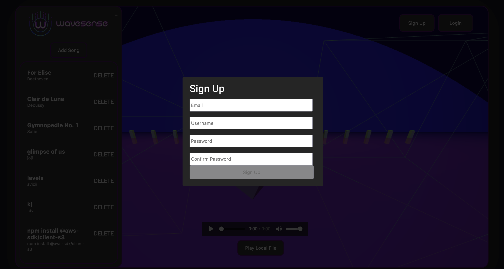
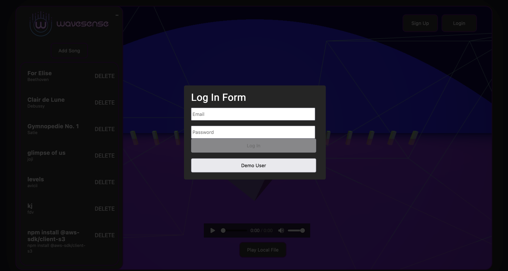
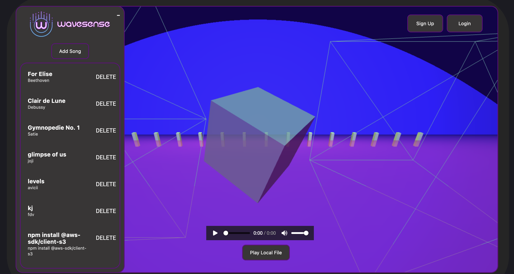

# Background

Do you wish there was a way to vibe with audio visually and audibly rather than only listening to it? [WaveSense](https://wavesense.herokuapp.com/ "WaveSense") is an audio visualizer application that enables users to select songs or upload local audio files, then feeds the selected audio into a visual display reflective of the audio waves. 

# Functionality & MVP
- ### New User and User Login
    New Users can sign up for an account by clicking the 'Sign Up' button in the Navigation Bar. If users already have an account, they can use login.
    
    

- ### Music Player and Music Visualizer
    Users can select a song from the song list on the left or upload a local audio file to start playing. The audio will feed into the visualizer and display movements.

    

- ### Songs
    Users can upload audio files and the song title will be displayed on the song list. 

- ### Playlists
    If a user is signed in, they can create playlists, update their own playlists, and delete a playlist. 


# Future Features
- Likes/favorites for top songs and playlists
- Search bar to find songs by name
- Interactive/game element that uses the sound data driving the visualizer

# Technologies & Technical Challenges

WaveSense is built on the MERN stack  (MongoDB, Express, React, and Node)

The visualizer is built using Canvas.

## Backend: MongoDB/Express

MongoDB, a noSQL database, is used as the database to hold User, Song, and Playlist document data. Express.js framework is used in the application's backend models, routes, and validations.

### Models:
Users: stores authentication information for the user and allows them to save their preferences for later use or use on other devices.

Songs: each song object has a title, url, and artist. The url is connected to where it is stored in AWS S3.

Playlists: playlists each have a creator that references the User model, a title, a description, and an array of songs.

## Frontend: React/Node.js

Visualizer: Canvas provides the visual context for the visualizer, using data provided by the audio file.

UI: we don't want to interupt the listening experience, so all user-interaction takes place on the same page. The React.js library is used to build components in the frontend. It allows the user to sign in and out and manipulate their playlists in modals, without leaving the main page. Once they're set up, the user is able to get the UI out of the way and enjoy the visualizer.


# Code Snippets
## Brian

```javascript 
//frontend/src/components/MainPage/MainPage.js
function MainPage() {

  const[songUrl, setSongUrl] = useState(null);

    return (
      <>
        <div id={styles.mainPageVideosContainer}>
          <Playlist songUrl={songUrl} setSongUrl={setSongUrl} />
          <Visualizer songUrl={songUrl}/>

```
The Main page renders two child components, Playlist and Visualizer, so that the same props of songUrl and setSongUrl can be passed to both siblings.
```javascript
//frontend/src/components/Playlist/Playlist.js
const handleClick = (e) => {
    e.preventDefault()
    setSelectedSong(e.target.id)
    // console.log('e.target', e.target)
    // console.log('selectedSong',selectedSong)
    setSongUrl(e.target.value);
}
```
Song elements within the Playlist component have both an id and a value. The handleClick helper function uses the song id to display information within the playlist, while passing the value to the Visualizer component. 
```javascript
const play = (file) => {
    console.log("file", file);
    console.log("url in play", url);

    //const audio = new Audio(url);
    const audio = audioRef.current //grab audio DOM element
    audio.src = url // grab source url from props
    //audio.src = URL.createObjectURL(file) // make passed-in file into dataURL
    
    audio.crossOrigin="anonymous"
    audio.load();
    audio.play(); // play audio
```
The Visualizer component receives the selected song URL, then loads the audio file from AWS S3 for concurrent visualizer analysis and audio playback. 

## May
```javascript
//backend/models/Playlist.js
const playlistSchema = Schema({
    creator: {
        type: Schema.Types.ObjectId,
        ref: 'User'
    },
    title: {
        type: String,
    },
    description: {
        type: String,
    }, 
    songs: {
        type: Array
    }
}, {
    timestamps: true
});
```
Each playlist object has four key attributes: creator, title, description, and songs. The value of a playlist's creator is an unique identifier(object Id) referencing the User documents. The title and description attributes are used to add details to the playlist. The value of songs are an array of song objects that belong to the specific playlist.  

```javascript 
//backend/routes/api/playlists.js
router.post('/', requireUser, async (req, res, next) => {
    try {
        const newPlaylist = new Playlist({
            creator: req.user._id,
            description: req.body.description,
            title: req.body.title, 
            songs: req.body.songs
        });

        let playlist = await newPlaylist.save();
        playlist = await playlist.populate('creator', '_id, username');
        return res.json(playlist);
    }
    catch(err) {
        next(err);
    }
});
```
The code above is the backend route to create a playlist. The router takes in a route, middleware(requireUser), and a callback function/route handler. If the request matches both the route('/') and the HTTP method(POST) it will hit the requireUser middleware then the route handler. The requireUser ensures there is a current user, otherwise it throws an error. The creator value is accessed from req.user which is provided by requireUser. The description, title, and songs values are accessed from the request body. The newly created playlist is saved then the creator value is a User object populated with the creator's Id and username keys and values, and finally the playlist is returned as a JSON reponse. 
